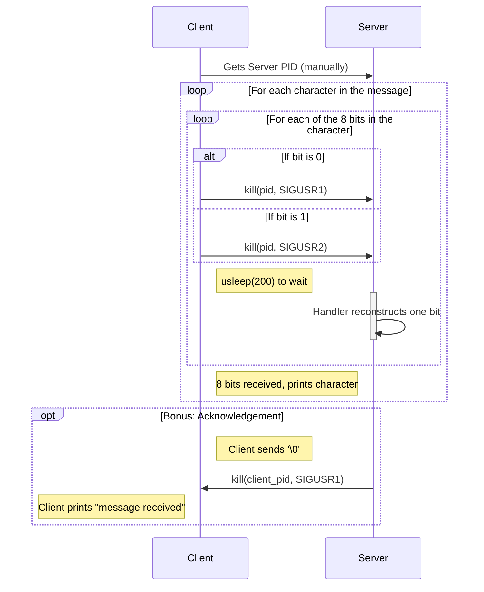

# 📡 Minitalk | 42 School Project

### A client-server program that sends messages one bit at a time, using only UNIX signals.


> *"This project is a fascinating exercise in Inter-Process Communication (IPC), demonstrating how to encode, transmit, and decode data using the most basic form of communication available in UNIX: signals."*

---

## 🎯 Project Overview

`minitalk` is a project that requires the creation of two programs: a **client** and a **server**. The goal is for the client to send a string of characters to the server, which then displays it. The unique constraint is that this communication must be performed *exclusively* using two UNIX signals: `SIGUSR1` and `SIGUSR2`.

This project forces a deep understanding of signal handling, bit manipulation, and process management.

## 🚀 Getting Started

#### 1. Clone the repository:

```bash
git clone https://github.com/MEHDIJAD/42cursus-minitalk.git
```

#### 2. Navigate to the project directory:

```bash
cd 42cursus-minitalk
```

#### 3. Compile the library:

```bash
# To compile the mandatory part
make

# To compile the bonus part
make bonus
```

## 🪾 Project Structure
```bash
.
├── Makefile
├── README.md
├── bonus
│   ├── client_bonus.c
│   ├── ft_atoi_bonus.c
│   ├── ft_get_utf8_byte_count_bonus.c
│   ├── ft_handler_bonus.c
│   ├── minitalk_bonus.h
│   └── server_bonus.c
├── ft_printf
│   ├── Makefile
│   ├── ft_print_format.c
│   ├── ft_printchar.c
│   ├── ft_printdigit.c
│   ├── ft_printf.c
│   ├── ft_printf.h
│   └── ft_printstr.c
└── mand
    ├── client.c
    ├── ft_atoi.c
    ├── minitalk.h
    └── server.c

4 directories, 19 files
```

---

## 🧠 Core Concepts Explored

| Concept | How It's Used in This Project |
| :--- | :--- |
| **UNIX Signals** | The entire communication protocol is built on `SIGUSR1` and `SIGUSR2`. These signals are used to represent the binary bits `0` and `1`. |
| **Signal Handling (`sigaction`)** | The server uses `sigaction` to set up a robust signal handler. `SA_SIGINFO` is used to get extra information, like the client's Process ID (PID), **which is crucial for the bonus part.** |
| **Bit Manipulation** | The client **deconstructs** each character into its 8 constituent bits. The server **reconstructs** these bits back into a character using `static` variables to maintain state between signal arrivals. |
| **Client-Server IPC** | This project is a foundational example of Inter-Process Communication. It establishes a one-way (mandatory) or two-way (bonus) communication channel between two independent processes. |
| **Process ID (PID)** | The client needs the server's PID to know where to send the signals. The server uses the client's PID to handle multiple clients and send acknowledgements in the bonus. |

---

## 💡 How It Works: The Signal Protocol

The communication is a clever encoding/decoding scheme based on binary.

1.  **The Client (Encoding & Sending):**
    *   To send a character (e.g., `'A'`, which is `01000001` in binary), the client iterates through its 8 bits.
    *   For each bit, it sends a signal to the server's PID:
        *   If the bit is `0`, it sends `SIGUSR1`.
        *   If the bit is `1`, it sends `SIGUSR2`.
    *   A small `usleep()` delay is added between each signal to ensure the server has enough time to process them and avoid signal loss.

2.  **The Server (Receiving & Decoding):**
    *   The server's signal handler (`ft_handler`) is the heart of the logic. It uses `static` variables to remember the state between signals.
    *   `static char c`: Stores the character being built.
    *   `static int bit`: Counts how many bits have been received (from 0 to 7).
    *   `static int power`: Acts as a bitmask (`1, 2, 4, 8...`) to place the incoming bit in the correct position.
    *   When a signal arrives, if it's `SIGUSR2` (a `1`), the `power` value is added to `c`. If it's `SIGUSR1` (a `0`), nothing is added. The `power` is then doubled for the next bit.
    *   When 8 bits have been received, the character `c` is complete. It is printed, and all the static variables are reset for the next character.

---

## ✨ Bonus Features

My implementation also includes the bonus parts:

-   **Message Acknowledgement:** After the server successfully receives the entire message (indicated by a null terminator `\0`), it sends a `SIGUSR1` signal back to the client. The client has its own handler to catch this signal and print a confirmation message.
-   **Unicode Support:** The bonus server can correctly receive and display multi-byte Unicode characters (like emojis `😀`). It does this by intelligently determining how many bytes a character consists of and waiting until all of them have been received before printing.

---

## 🔄 Communication Flowchart

This sequence diagram shows how the client and server communicate to send a single character.



###  Run the programs:

**You will need two separate terminal windows.**

#### In Terminal 1: Run the Server

```bash
# For the mandatory version
./server

# For the bonus version
./server_bonus
# It will print its PID, for example:
# server PID: 12345
```

#### In Terminal 2: Run the Client

```bash
# For the mandatory version
./client 12345 "Hello from the other side!"

# For the bonus version
./client_bonus 54321 "This message has Unicode! 🚀 and an acknowledgement."
```

**The server in Terminal 1 will display the message character by character.**

## 👨‍💻 Author

- 42 Intra: [eel-garo](https://profile.intra.42.fr/users/eel-garo)
- GitHub: [MEHDIJAD](https://github.com/MAHDIJAD)
